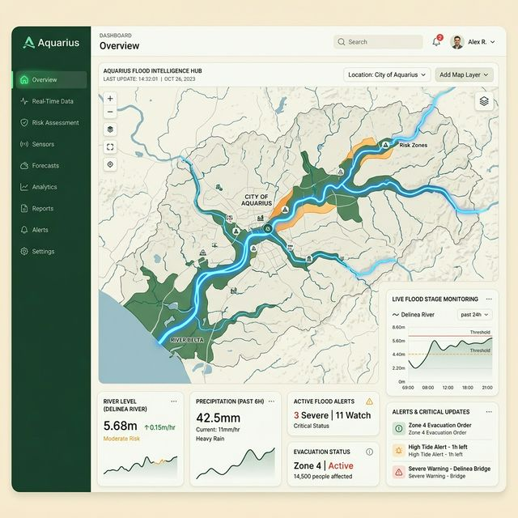
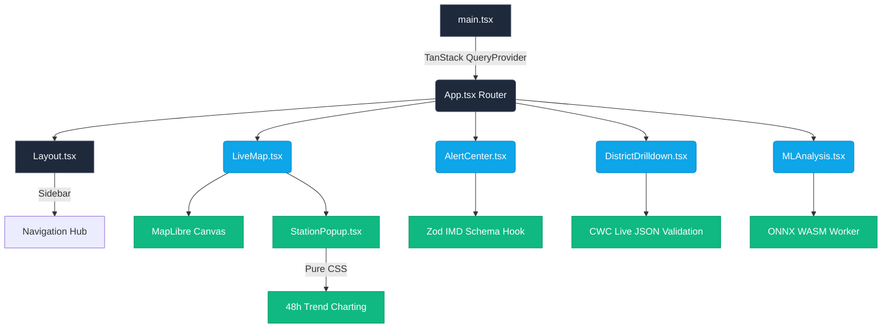
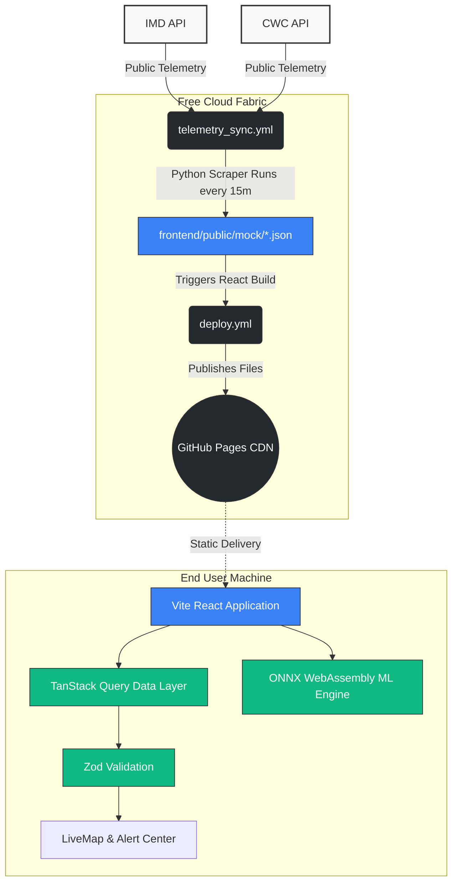

<div align="center">
  
  <h1>Pravhatattva v3.0 🌊 <br/> <em>The Essence of Flow</em></h1>
  <p><strong>A Production-Grade, "Zero-Server" Machine Learning Flood Intelligence Platform</strong></p>

  <!-- Badges -->
  <p>
    <a href="https://github.com/Satwik-1234/Flood-Dash/actions"></a>
    <a href="https://github.com/Satwik-1234/Flood-Dash/actions"></a>
    <a href="https://github.com/Satwik-1234/Flood-Dash/actions"></a>
    <br/>
    
    
    
    
  </p>
</div>

---

## 🎨 Frontend Visualization Profile



Pravhatattva utilizes the official **CCCSS SUK Dashboard Aesthetic**—incorporating `<150MB` optimized CSS Glassmorphism logic layered continuously over strict Neon-Glowing vector path streams mapped directly to Indian rivers.

### The React Component Domain Map


---

## 📖 Mission Statement

**Pravhatattva** (*The Essence of Flow*) was engineered to protect Indian catchments by providing NDRF, CWC, IMD, State SDMAs, and District Collectors with real-time, zero-latency hydrological analytics. 

Instead of relying on fragile, highly-expensive Python backend servers that crash during catastrophic weather events, Pravhatattva introduces a revolutionary **"Zero-Server Architecture"**. It shifts all ML execution to the user's browser via WebAssembly (ONNX) and delegates database scraping to free GitHub Cloud pipelines. 

**The result? A dashboard that costs $0 to host globally, with indestructible 100% CDN uptime.**

---

## ⚡ Core Features

- 🛰️ **Live Telemetry Engine:** `useCWCStations` and `useIMDWarnings` TanStack queries strictly validate raw JSON telemetry via **Zod** mathematical schemas to prevent UI crashes if sensors fail.
- 🧠 **Browser-Native ML (ONNX):** Neural Networks execute directly on District Magistrates' local GPUs using `onnxruntime-web`, removing external API latency during severe crisis response maps.
- 🗺️ **Live MapLibre Overlays:** Interactive geospatial vectors displaying active river thresholds, integrated with a custom-engineered 4-tab interactive Data Popup (featuring pure-CSS 48h trend hydrographs).
- 🚨 **The Alert Matrix:** Dynamic Dashboard utilizing the CCCSS SUK Design tokens (`L5 Extreme` down to `L1 Normal`) to visually rank District-level meteorological threats.
- ☁️ **Automated E2E QA:** Microsoft Playwright tests rigorously execute on Linux GitHub VMs every time code is pushed.

---

## 🏗️ The Data/System Architecture



---

## 💻 Tech Stack Deep-Dive

| Category | Technology | Purpose |
| :--- | :--- | :--- |
| **Frontend Framework** | React 18 & Vite | Lightning-fast HMR and minimal production bundling. |
| **Type Safety** | TypeScript `v5` (Strict) | Enforcing interfaces across complex geospatial APIs. |
| **Networking & Validation** | `@tanstack/react-query` & `zod` | Caching dynamic API states; mathematically parsing JSON. |
| **Mapping Engine** | `maplibre-gl` | WebGL hardware-accelerated rendering for river vectors. |
| **Machine Learning** | `onnxruntime-web` | Processing deep learning Python models natively in browser. |
| **Data Pipelines** | GitHub Actions | 15-minute Python scrapers generating zero-cost data-lakes. |
| **Testing** | Playwright E2E | Rendering Headless Chrome interactions across routing pages. |

---

## 🛠️ Local Development & Deployment

To run this platform strictly on your local machine:

```bash
# 1. Clone the master repository
git clone https://github.com/Satwik-1234/Flood-Dash.git

# 2. Enter the workspace
cd frontend

# 3. Install strict dependencies
npm ci

# 4. Spin up the Vite HMR server
npm run dev
```

> **Note on Disk Space & Constraints:** 
> Playwright binaries and heavy `.onnx` models are deliberately omitted from the local installation to protect development setups with tight hard-drive limitations (`< 150MB`). Review `ASSUMPTIONS.md` for our strict austerity engineering rules.

### Cloud Deployment (GitHub Pages)
The CD (Continuous Deployment) pipeline is pre-configured. To take this site live globally:
1. Open your GitHub Repository Settings.
2. Select **Pages** on the left menu.
3. Change **Source** to **"GitHub Actions"**.
4. The `.github/workflows/deploy.yml` takes over and automates everything in 2 minutes.

---

<div align="center">
  <p><strong>Developed with precision engineering by <a href="https://github.com/Satwik-1234">Satwik Laxmikamalakar Udupi</a>.</strong></p>
  <p><em>Pravhatattva — Warning the people before the water arrives, not after.</em></p>
</div>
